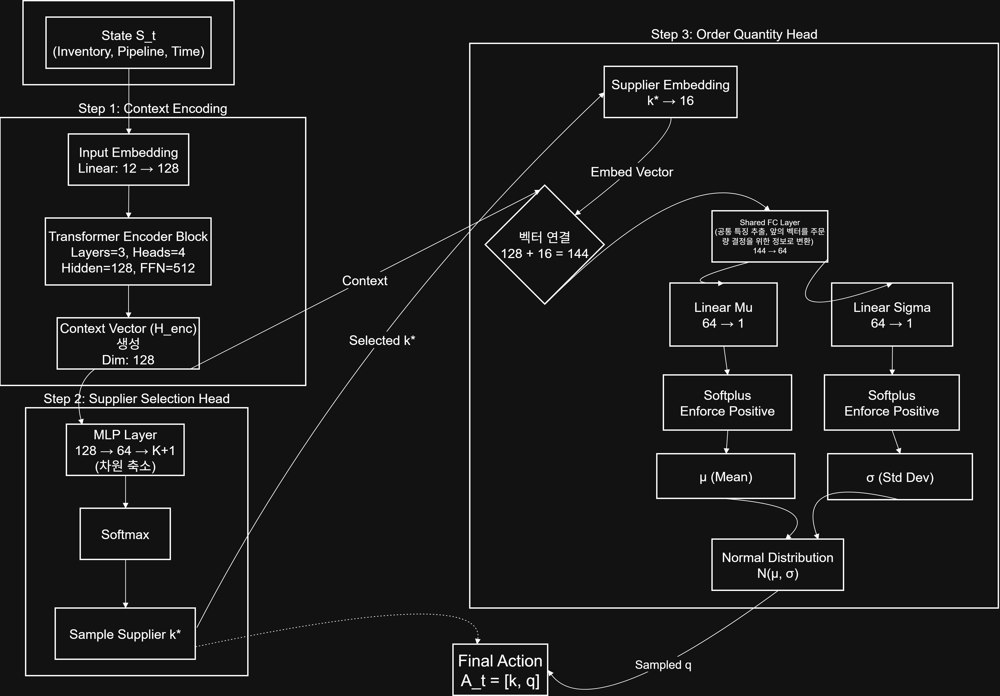
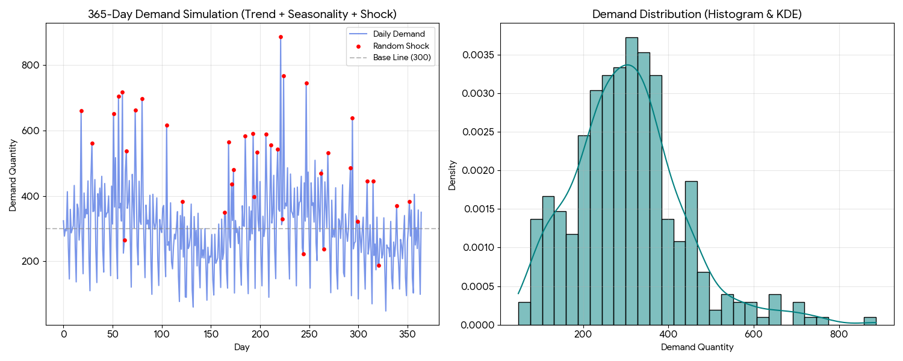

# 📦 Deep Reinforcement Learning for Dynamic Supplier Selection and Inventory Optimization

> **이질적 리드타임과 비정상 수요 환경에서 Transformer 기반 Encoder-Dual Decoder 강화학습을 활용한 동적 공급업체 선정 및 주문량 최적화**

## 💡 프로젝트 개요 (Overview)
본 프로젝트는 다수의 공급업체가 존재하는 환경에서 **업체별로 상이한 리드타임(Lead Time), 최소주문수량(MOQ), 단가 제약 및 불확실한 비정상 수요**에 대응하는 SCM(공급망 관리) 의사결정 자동화 솔루션입니다. 

이산 시간 판매 손실 재고 시스템(Zipkin, 2008)을 기반으로 SCM 동역학을 MDP(Markov Decision Process)로 정밀하게 모델링하였으며, 시계열 패턴 및 변수 간 상관관계를 포착하기 위해 **Transformer Encoder**와 공급업체 선택 및 주문량을 동시에 결정하는 **Dual Decoder** 구조의 강화학습 에이션트를 구축했습니다.

## 🎯 핵심 문제 정의 & 수리적 모델링 (Problem Formulation)
본 연구의 목표는 계획 기간 $T$ 동안 발생하는 SCM 총비용(구매비, 운송비, 재고유지비, 품절 페널티, 창고용량 초과 페널티)의 기대값을 최소화하는 최적 정책(Policy)을 수립하는 것입니다.

* **상태 공간 (State Space, $S_t$):** 현재 재고($I_t$), 파이프라인 물량 벡터($x_t$), 수요의 계절성 변수
* **행동 공간 (Action Space, $A_t$):** 어떤 공급업체를 선택할 것인가($k \in \mathcal{K}$), 얼마나 주문할 것인가($q_{t,k} \ge 0$)
* **시스템 동역학 및 제약 조건 (System Dynamics):**
  * **재고 보존식:** $I_{t+1} = I_t - D_t + x_t^1$ (당일 도착분은 익일 영업부터 반영)
  * **창고 용량 제약:** 한정된 창고 용량($CAP$)을 초과할 경우 선형적인 용량 페널티 비용($\omega$) 부과
  * **공급업체 제약:** 각 업체별 최소주문수량($MOQ_k$), 트럭당 운송 비용($C_{ship,k}$), 적재 용량($C_{cap,k}$) 반영

## 🧠 모델 아키텍처 (Model Architecture)
면접관들이 직관적으로 논리 구조를 파악할 수 있도록 **Encoder-Dual Decoder 순전파 아키텍처**를 설계했습니다.



1. **State Encoding 단계:** 현재 재고 및 파이프라인 상태 시퀀스를 임베딩하여 특성 벡터 $H_{enc}$ 추출
2. **Dual Decoder 단계 (Multi-Task Learning 구조):**
   * **Phase 1 (공급업체 선택):** $H_{enc}$를 기반으로 `Categorical Distribution`을 형성하여 최적의 공급업체 $k^*$ 샘플링 (Null 주문 포함 $K+1$ 차원)
   * **Phase 2 (연속적 주문량 결정):** 선택된 공급업체의 특성을 조건부 반영하여 `Normal Distribution`을 형성하고, 최종 연속형 변수인 최적 주문 수량 $q_{t,k^*}$ 도출

## 📉 학습 알고리즘 (Learning Algorithm)
* **Baseline 기반 REINFORCE:** 정책 학습의 분산을 줄이기 위해 Greedy 롤아웃 모델을 베이스라인($\theta^{BL}$)으로 두고, 샘플링 모델과의 Advantage를 계산하여 정책 네트워크를 업데이트합니다.
* **T-test 검증 기반 업데이트:** 에폭마다 통계적 가설 검정(t-test)을 수행하여 샘플링 정책이 기존 베이스라인보다 유의미하게 뛰어날 때만 베이스라인 가중치를 갱신하도록 설계하여 학습 안정성을 극대화했습니다.

## 📊 시뮬레이션 결과 및 성과 (Results)
전통적인 SCM 최적화 방식인 **Base Stock Policy (BSP) 휴리스틱 모델**과 **RL-Transformer 에이전트**의 100일간 시뮬레이션 성능비교를 수행했습니다.

* **비용 최소화 달성:** 불확실성이 높은 변동 수요 상황에서 RL 에이전트가 리드타임을 선제적으로 계산하여 주문을 최적화함으로써 뉴스벤더 분위수를 따르는 BSP 모델 대비 **총비용의 비약적인 절감**(**59%감소**, BSP:20,884,283 vs DRL with Transformer: 8,626,090)을 증명했습니다.
* 

* **제약 조건 관리 능력:** 창고 용량 한계를 넘어설 때 발생하는 페널티 비용을 회피하기 위해, 에이전트가 스스로 안전재고 수준을 동적으로 조절하는 자율적 제어 패턴을 보였습니다.

## 📁 레포지토리 상세 구조 (Repository Structure)
* `src/train_model_local.py`: 로컬 자원을 활용하여 듀얼 디코더 정책 네트워크를 강화학습시키는 메인 코드
* `src/Test_model.py`: 학습된 최적 모델 가중치(`best_model_epoch_049_cost_32.pt`)를 불러와 Heuristic 알고리즘과 대조 평가하는 시뮬레이터
* `notebooks/Test_SCM_Transformer_GRB.ipynb`: 시뮬레이션 로그 및 누적 비용 그래프 확인을 위한 분석 노트북
* `docs/mdp_formulation.pdf`: Zipkin(2008) 기반 이산 시간 재고 시스템 수리 모델 전문
* `docs/algorithm_pseudocode.pdf`: 듀얼 디코더 순전파 및 Baseline 갱신 알고리즘의 수도코드
* `docs/mdp_trajectory.pdf`: 상태-행동-비용 변화 흐름을 추적한 에피소드 시뮬레이션 로그 샘플
* `docs/supplier_info.pdf`: 5개 공급업체(A~E) 단가·MOQ·트럭 용량·배송비·리드타임 정보 테이블
* `docs/latex/`: 위 문서 PDF의 LaTeX 소스 (변수 정의·MDP 궤적·수도코드·업체 정보 테이블) — PDF 재현용

## 📦 환경 설정 (Environment)
* **수요**: 평균 300개/일, 표준편차 30 정규분포 + 주말 감소 **계절성(비정상성)** 반영
* **공급업체**: 특성 상이한 5개(A~E) — 단가·MOQ·트럭 용량·**계단식 배송비**·확률적 리드타임
* **비용 구조**: 재고유지비(h) + 백오더 페널티(b, 이월) + 구매비 + 트럭 배송비 + 창고 초과 페널티



## 🚀 시작하기 (How to Run)
```bash
# 1. 의존성 라이브러리 설치
pip install torch numpy scipy pandas matplotlib

# 2. Heuristic vs RL 에이전트 시뮬레이션 비교 평가 실행
python src/Test_model.py
